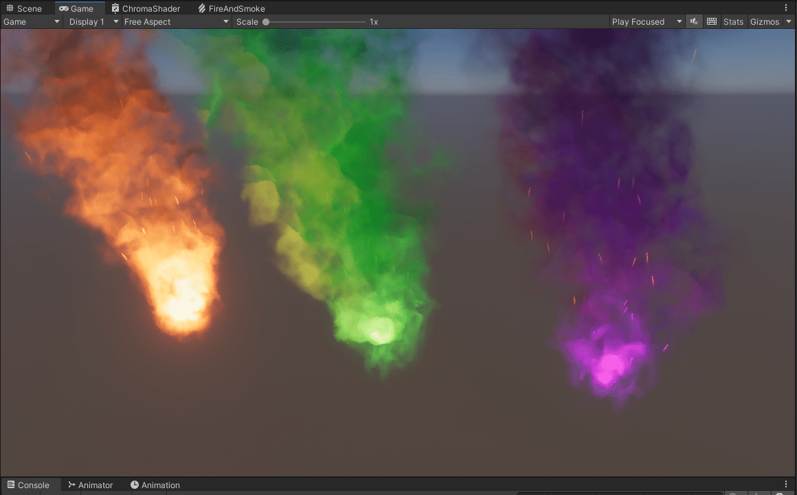
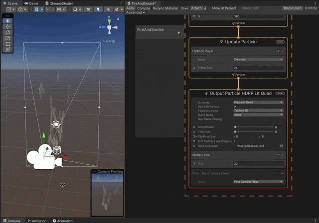
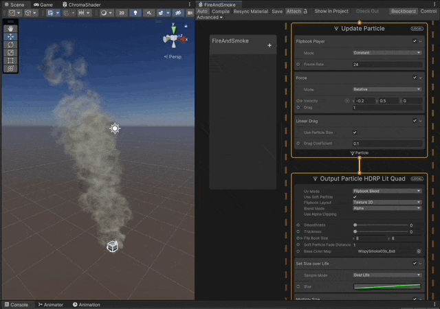
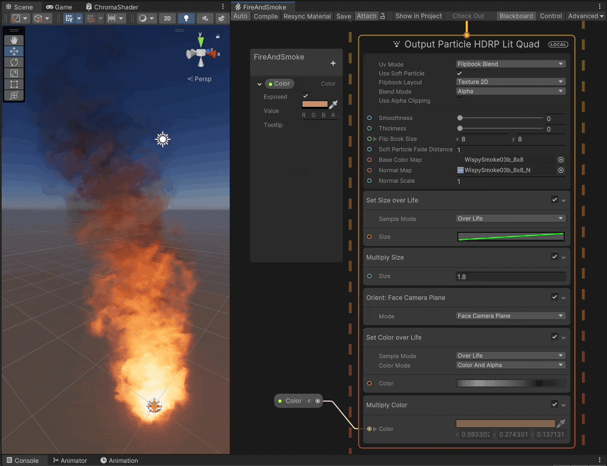

# Fire VFX

Fire, smoke and sparks vfx using VFX Graph in Unity **Unity 2021.3.10f1**

### Reference Tutorial

- [Fire VFX by Brackeys](https://www.youtube.com/watch?v=R6D1b7zZHHA)

## Features

- [Random Velocity, Angle and Lifetime](#random-velocity-angle-and-lifetime)
- [Flipbook Animation](#flipbook-animation)
- [Face Camera Plane](#face-camera-plane)
- [Size over Life](#size-over-life-wind-and-drag-forces)
- [Wind and Drag Forces](#size-over-life-wind-and-drag-forces)
- [Color Multiply and Color over Life](#color-multiply-and-color-over-life)
- [Normal Maps](#normal-maps)
- [Lighting](#lighting)
- [Sparks Effect](#sparks-effects)

## Screenshots

---

### Random Velocity, Angle and Lifetime

[Fire VFX by Brackeys](https://www.youtube.com/watch?v=R6D1b7zZHHA)

### Flipbook Animation

### Face Camera Plane

### Size over Life, Wind and Drag Forces

### Color Multiply and Color over Life

---

### Normal Maps

#### Without Normal Maps

#### With Normal Maps

---

#### Fire/Smoke VFX Graph

---

### Lighting

### Sparks

---

#### Sparks VFX Graph

---

## Implementation explained

1. **Project configuration**

   1. Use the High Definition Render Pipeline.
   1. Use VFX Graph.

1. **Particles Randomness**

   1. In the **Initialize** node of the VFX.
      1. Set initial velocity of particles to a random range.
      1. Set lifetime of particles to a random range.
      1. Set initial Z angle of particles to a random angle.

1. **Flipbook animation**

   1. Replace default quad output node with a **Lit Quad Output** node.
      1. Use soft particles and set smoothness to zero.
      1. Set the material type to translucent.
      1. Set the color map texture to the sprite sheet with all the sprites for the smoke animation.
      1. Set the "UV mode" to _FlipbookBlend_ and set the x and y size.
   1. In the **Update** node of the VFX.
      1. Add a flipbook player and set the framerate.

1. **Face Camera**

   1. in the **Lit Quad Output** node
      1. Add an "Orient" component to make particles face the camera always.

1. **Size over Life and Wind Forces**

   1. in the **Lit Quad Output** node
      1. Add a size over life curve to make particles change size over.their life.
   1. in the **Update** node
      1. Add a relative force to make the smoke be affected by the wind.
      1. Add a linear drag using the particle size, to make particles have different drag during their lifetime.

1. **Color Multiply and Color over Life**

   1. in the **Lit Quad Output** node
      1. Set "Use base color map" to just _Alpha_, to be able to fully control the color of the sprites.
      1. Set a gradient for the color over life, to make particles change color during their lifetime.
      1. Add a color parameter to multiply color, to be able to tint the whole smoke together.

1. **Normal Map and Lighting**

   1. in the **Lit Quad Output** node
      1. Enable "Use Normal Map".
      1. Set the normal map.
      1. If the VFX has [an unusual green tint](https://helloarduino.tistory.com/entry/The-green-tint-issue-in-VFX-graph), then you need to create a new diffussion profile asset and set it to the **Lit Quad Output** node.
   1. Add a point light at the bottom of the VFX to make the normal maps more noticeable.

1. **Sparks Effect**
   1. Add a **Swarm Particle System** next to the main system in the VFX
      1. Turn down the defaul values to have just a few sparks.
      1. Adjust lifetime values.
   1. in the **Initialize** and **Update** nodes
      1. Copy paste the random initializations and forces from the nodes of the smoke, to have sparks mimic the same effects.
   1. in the **Lit Quad Output** node
      1. Set "Multiply Color" to make sparks glow.
   1. in the **Update** nodes
      1. Add a turbulance affected by a time node.
